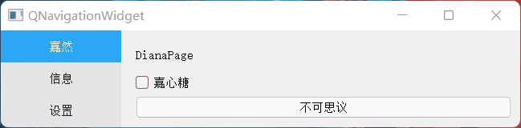

# QNavigationWidget
A completed implementation of navigation widget for qt, including a beautiful tabbar and a switchable stacked area.



## Usage

You can generate the document of this project use doxygen. The `Doxygen` file is in the `Src` directory.

```shell
doxygen Doxygen
```


### QNavigationTab

QNavigationTab is a implementation of tabbar.

Example:

```cpp
#include "QNavigationTab.h"

void test()
{
    QNavigationTab tab;
    tab.addItem("Tab1", "This is Tab1");
    tab.addItem("Tab3", "This is Tab3");
    tab.insertItem(1, "Tab2", "This is Tab2");
}
```


### QNavigationWidget

QNavigationWidget is a completed implementation of QNavigationWidget.

Example:

```cpp
#include "QNavigationWidget.h"

void test()
{
    QNavigationWidget navigation;
    QWidget *page1 = new QWidget;
    QWidget *page2 = new QWidget;
    QWidget *page3 = new QWidget;
    
    navigation.addTab(page1, "Tab1", "This is Tab1");
    navigation.addTab(page3, "Tab3", "This is Tab3");
    navigation.insertTab(1, page2, "Tab2", "This is Tab2");
}
```


### Customize the tab style

There are also some interfaces to customize the style of tab, including the `backgroundcolor`, `selectedcolor`, `rowHeight` and `tabWidth`. You can find them in the document or you can read the source code directly.
